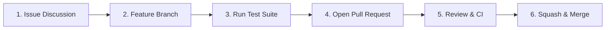

# Contributing to RAGeval

Thank you for your interest in contributing to **RAGeval**! RAGeval is a production RAG observability, continuous DSPy evaluation, and KPI scoring benchmark engine.

---

## 📜 Table of Contents

1. [Code of Conduct](#code-of-conduct)
2. [Licensing & Commercial Boundary](#licensing--commercial-boundary)
3. [Developer Certificate of Origin (DCO)](#developer-certificate-of-origin-dco)
4. [Contribution Workflow](#contribution-workflow)
5. [Evaluation Metrics & Tracing Standards](#evaluation-metrics--tracing-standards)
6. [Local Development & Setup](#local-development--setup)
7. [Testing Standards](#testing-standards)
8. [Commit Message Standards](#commit-message-standards)
9. [Security & Vulnerability Disclosure](#security--vulnerability-disclosure)

---

## 🤝 Code of Conduct

All contributors agree to foster an open, welcoming, and harassment-free community.

---

## ⚖️ Licensing & Commercial Boundary

RAGeval is licensed under the **GNU Affero General Public License v3.0 (AGPL-3.0)**.

- **Open Source Contributions**: All submissions become licensed under AGPL-3.0.
- **Commercial & Enterprise Licensing**: For proprietary RAG pipeline auditing, closed-source enterprise telemetry, or exemption from AGPL-3.0 copyleft obligations, commercial licenses are available through **OmniIntelOS**. See [`COMMERCIAL.md`](./COMMERCIAL.md) or contact `siddoyacinetech227@gmail.com`.

---

## ✍️ Developer Certificate of Origin (DCO)

All commits must include a sign-off certifying DCO compliance (`git commit -s`):

```bash
git commit -s -m "feat(eval): add contextual precision metric with DSPy assertion"
```

---

## 📊 Evaluation Metrics & Tracing Standards

When adding new evaluation metrics or telemetry collectors:
- Ensure all scoring formulas (Faithfulness, Context Precision, Answer Relevance, Semantic Drift) are deterministic when evaluated with mock judge scores.
- Support OpenTelemetry-compliant trace spans for end-to-end RAG pipelines.
- In-memory event rings and WebSocket broadcast handlers must isolate session telemetry.

---

## 🔄 Contribution Workflow



1. **Issue First**: Open an issue describing the metric or framework addition.
2. **Branch**: Branch from `master` (`feat/...` or `fix/...`).
3. **Tests**: Ensure all local tests pass.
4. **Pull Request**: Open PR referencing the issue.

---

## 🛠️ Local Development & Setup

### Prerequisites
- Python 3.11+
- PostgreSQL (optional for local mocked tests; SQLite fallback is supported)

### Environment Setup
```bash
# 1. Clone repository
git clone https://github.com/Yacine-ai-tech/RAGeval.git
cd RAGeval

# 2. Virtual environment setup
python3 -m venv venv
source venv/bin/activate

# 3. Install in editable mode
pip install -e .
pip install -r requirements.txt

# 4. Copy environment template
cp .env.example .env
```

---

## 🧪 Testing Standards

```bash
pytest tests/ -v
```

- Mock all LLM judge calls and external tracing endpoints in automated unit tests.
- Ensure OTEL exporter and decorator tests execute without live OpenTelemetry collectors.

---

## 📝 Commit Message Standards

Use [Conventional Commits](https://www.conventionalcommits.org/):

`feat:`, `fix:`, `docs:`, `test:`, `refactor:`, `perf:`, `chore:`

---

## 🔒 Security & Vulnerability Disclosure

Report vulnerabilities privately via email to `siddoyacinetech227@gmail.com`.
